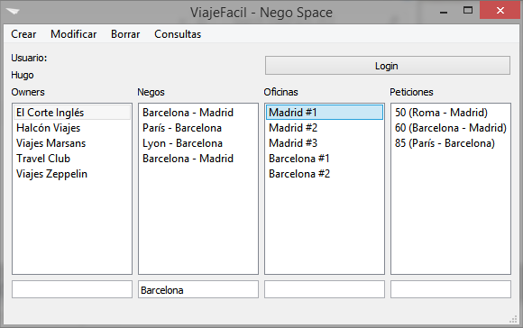

# :globe_with_meridians: ViajeFácil :airplane:

[](https://travis-ci.org/hugo19941994/ViajeFacil)
[](https://coveralls.io/github/hugo19941994/ViajeFacil?branch=master)
[](https://github.com/hugo19941994/ViajeFacil/blob/master/LICENSE)

Software para gestionar agencias de vuelos.

Proyecto integrador de 1º de la [Universidad Europea de Madrid (UEM)](http://madrid.universidadeuropea.es/) con [Unisys](http://www.unisys.es/) - 2015



## Compilar

```bash
$ cd source
$ qmake
$ make
$ make clean
```

## Equipo

* [Hugo Ferrando Seage](https://hugofs.com)
* [David Jiménez Cuevas](https://github.com/jimecu12)
* [Estefanía Ortego García](https://github.com/Estefania1007)
* [Guillermo González Moreno](https://github.com/guilleglezmo)
* [Fernando Saavedra Hernández](https://github.com/FeR12J)
* [Sergio Candel](https://github.com/SergioCandel)
